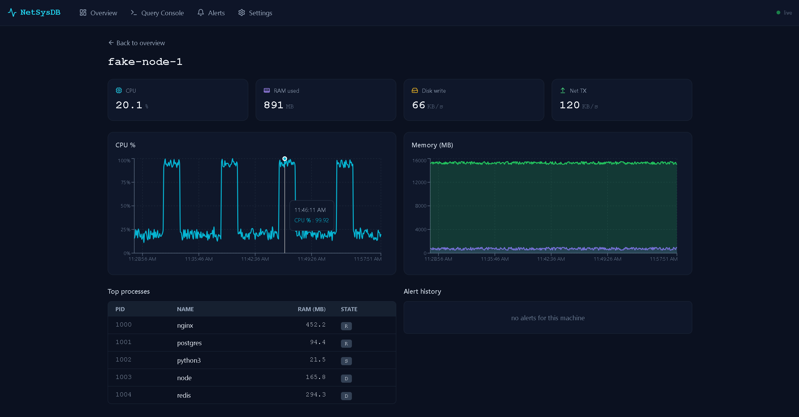
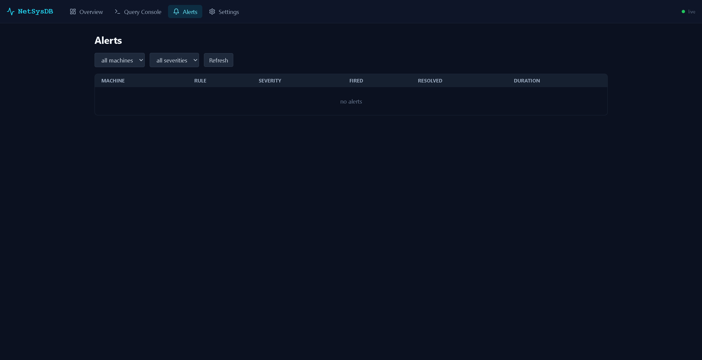

# NetSysDB


A distributed system monitor built from scratch: agents read Linux `/proc`, send metrics over a custom binary TCP protocol, get stored in a hand-written database with a B+ tree index, and appear live on a React dashboard. No external databases, no monitoring frameworks—every layer is custom-built.

> ⚡ **Built from scratch** — no SQLite, no psutil, no asyncio. Every layer is hand-written.

---

## 📸 Screenshots

### Live Overview Dashboard

*Three machine cards updating live — green = healthy, amber = alert, red = offline*

### Machine Detail View  

*Real-time CPU and RAM charts with process table*

### Query Console

*SQL-like queries running against the hand-built B+ tree indexed storage engine*

### Alerts Page

*Rule-based anomaly alerts with severity levels and resolution tracking*

> 📷 **To add screenshots:** Run `docker-compose up --build`, open http://localhost:5000, take screenshots of each page, and save them as `screenshots/overview.png`, `screenshots/machine_detail.png`, `screenshots/query_console.png`, `screenshots/alerts.png`.

---

## 🤔 What is this?

Imagine you run three Linux servers. Every few minutes, you SSH into each one to check if the CPU is spiking or RAM is running low. It's slow, error-prone, and doesn't scale beyond a handful of machines. A proper monitoring system watches all servers from one place and alerts you when something goes wrong—like a car dashboard that shows speed, fuel, and engine temperature instead of making you check each gauge separately.

NetSysDB does exactly that. It runs a lightweight agent on each machine that reads system stats (CPU, RAM, disk I/O, network) every 5 seconds and sends them to a central collector. The collector stores every metric in a database it built from the ground up, indexes them with a B+ tree for fast queries, and pushes live updates to a web dashboard in your browser. You see all your machines in one place, spot trends, and drill into any machine's detail page.

The reason this is a strong CS project is that **real monitoring tools like Datadog, Prometheus, and Grafana are installed, not built**. This project builds every layer from the ground up: the network protocol (binary TCP, not HTTP), the storage engine (paged binary files, not SQLite), the indexing (B+ tree, hand-written), the query engine (SQL-like parser), and the web interface (React). It demonstrates deep understanding of operating systems, databases, networking, and full-stack development.

---

## 🏗️ Architecture

```
┌─────────────┐
│   agent-1   │  reads /proc (CPU, RAM, disk, network)
│   agent-2   │  every 5 seconds
│   agent-3   │
└──────┬──────┘
       │  Custom binary TCP protocol (port 9000)
       │  UDP heartbeat (port 9001)
       ▼
┌─────────────────────────────────────────┐
│            COLLECTOR SERVER             │
│                                         │
│  ① Receive   →  decode binary message   │
│  ② Validate  →  check required fields   │
│  ③ Store     →  write to binary pages   │
│  ④ Index     →  insert into B+ tree     │
│  ⑤ Alert     →  check sliding windows   │
│  ⑥ Broadcast →  push to browser via WS  │
│                                         │
│  ┌─────────────┐  ┌──────────────────┐  │
│  │ Storage     │  │  B+ Tree Index   │  │
│  │ 4KB pages   │  │  on timestamp    │  │
│  │ + WAL log   │  │  for range query │  │
│  └─────────────┘  └──────────────────┘  │
│                                         │
│  Flask REST API + Socket.IO  :5000      │
└──────────────────┬──────────────────────┘
                   │ HTTP + WebSocket
                   ▼
       ┌───────────────────────┐
       │   React Dashboard     │
       │  Overview · Detail    │
       │  Query · Alerts       │
       │  Settings             │
       └───────────────────────┘
```

**① Receive** — The collector accepts TCP connections from agents, reads the 10-byte binary header, then the JSON payload.

**② Validate** — Required fields (machine_name, timestamp, cpu_percent, ram_used_mb, ram_total_mb, disk_read_kb, disk_write_kb, net_rx_kb, net_tx_kb) are checked; bad messages are dropped.

**③ Store** — Valid metrics are packed into 44-byte binary records and written to 4KB pages in the data file, with a free-space bitmap to track available slots.

**④ Index** — Every record is inserted into a B+ tree keyed on timestamp for fast range queries ("give me all metrics from agent-1 in the last 10 minutes").

**⑤ Alert** — Sliding-window rules (e.g., "CPU > 85% for 5 minutes") are evaluated; when a threshold is crossed for the full window duration, an alert fires and persists to disk.

**⑥ Broadcast** — Fired alerts and new metrics are pushed to all connected web browsers via WebSocket, so the dashboard updates live without polling.

---

## ✨ Features

| Feature | Description |
|---------|-------------|
| 🔴 **Live Monitoring** | CPU, RAM, disk, and network stats update every 5 seconds in the browser |
| 🗄️ **Hand-built Database** | Binary page-based storage engine with free-space bitmap — no SQLite |
| 🌳 **B+ Tree Index** | Custom B+ tree on timestamps for fast range queries (O log n lookup) |
| 🛡️ **Crash Recovery** | Write-ahead log (WAL) ensures no data loss if the server crashes mid-write |
| 🔍 **SQL-like Queries** | Query your metrics with SELECT, WHERE, GROUP BY, ORDER BY, LIMIT |
| ⚡ **Real-time Alerts** | Sliding-window anomaly detection fires alerts when thresholds are crossed |
| 🎭 **Fake Agents** | Simulate CPU spikes, RAM pressure, and dying nodes without real hardware |
| 🐳 **One Command Deploy** | `docker-compose up --build` starts everything |

---

## 🛠️ Tech Stack

### Backend (Python 3.11)

- **socket** — Opens raw TCP connections between agents and collector. No HTTP wrapper, pure protocol.
- **struct** — Packs metric data into 44-byte binary records and unpacks them from disk pages.
- **selectors** — Non-blocking I/O event loop in the collector (accept TCP, read UDP, handle timeouts).
- **threading** — Agent runs reader, sender, and heartbeat as separate daemon threads.
- **flask** — REST API server (7 endpoints); runs on port 5000.
- **flask-socketio** — WebSocket upgrades for live dashboard updates without polling.
- **json** — Payload serialization between agents and collector; alert/rule persistence.
- **uuid** — Generates unique IDs for alerts and internal tracking.

### Frontend (React 18)

- **React 18** — Component-based UI; hooks for state and side effects.
- **Vite** — Fast dev server and production bundler (replaces Create React App).
- **Tailwind CSS** — Utility-first styling; responsive design out of the box.
- **Recharts** — Live-updating line charts for CPU and RAM trends.
- **socket.io-client** — Subscribes to WebSocket events for live metric and alert updates.
- **axios** — HTTP client for REST API calls (machines, metrics, alerts, queries).
- **lucide-react** — Lightweight SVG icon library (activity, alert, check, etc.).

### Infrastructure

- **Docker & Docker Compose** — One `docker-compose.yml` spins up collector, 3 real agents, and 2 fake agents as separate services.
- **Git** — Version control; all code is tracked and reproducible.

---

## 📁 Project Structure

```
.
├── README.md                      # This file
├── requirements.txt               # Python dependencies (Flask, pytest, black, etc.)
├── docker-compose.yml             # 6 services: collector, agent-1/2/3, fake-agent-1/2
├── Dockerfile                     # Multi-stage image for all services
├── .dockerignore                  # Exclude node_modules and src files
├── .gitignore                     # Ignore data/, __pycache__, node_modules, .pytest_cache
├── .claude/
│   └── launch.json                # Vite dev server config for preview
│
├── agent/                         # Lightweight agent (runs on each monitored machine)
│   ├── __init__.py                # Makes agent a package
│   ├── proc_reader.py             # Five readers: cpu, memory, processes, disk, network
│   ├── agent.py                   # MetricReader/Sender/heartbeat threads, TCP backoff
│   └── fake_agent.py              # Simulates metrics (cpu_spike, ram_pressure, dying, etc.)
│
├── collector/                     # Central data collection and processing
│   ├── __init__.py                # Makes collector a package
│   └── collector.py               # Selectors loop, 6-step pipeline, Flask daemon
│
├── storage/                       # Database internals (pages, WAL, B+ tree)
│   ├── __init__.py                # Makes storage a package
│   ├── engine.py                  # Page-based store, bitmap, write/read/scan
│   ├── wal.py                     # Write-ahead log: 64-byte lines, recovery on crash
│   └── bplustree.py               # B+ tree (t=50) with linked leaf list, range queries
│
├── query/                         # SQL-like query engine
│   ├── __init__.py                # Makes query a package
│   ├── parser.py                  # Tokenizer, AST builder (SELECT/WHERE/GROUP BY/ORDER BY)
│   └── engine.py                  # Executor: tree traversal, WHERE filtering, aggregates
│
├── alerts/                        # Rule-based anomaly detection
│   ├── __init__.py                # Makes alerts a package
│   ├── engine.py                  # Sliding-window deques, fire/resolve logic
│   └── rules.json                 # Default rules: cpu_high, ram_high, etc.
│
├── web/                           # Flask backend and WebSocket
│   ├── __init__.py                # Makes web a package
│   ├── state.py                   # Shared state: machines, storage, alerts
│   ├── api.py                     # 7 REST endpoints, manual alert creation
│   └── socket_server.py           # Flask app, Socket.IO emits
│
├── shared/                        # Shared utilities
│   ├── __init__.py                # Makes shared a package
│   └── protocol.py                # Binary protocol: encode/decode, MSG_METRIC, constants
│
├── ui/                            # React frontend
│   ├── package.json               # npm dependencies, build scripts
│   ├── vite.config.js             # Vite config with /api proxy
│   ├── tailwind.config.js         # Tailwind setup
│   ├── index.html                 # SPA entry point
│   ├── src/
│   │   ├── main.jsx               # React mount point
│   │   ├── App.jsx                # Router, layout, navbar
│   │   ├── api.js                 # Axios client with base URL and headers
│   │   ├── pages/
│   │   │   ├── Overview.jsx       # Machine cards with status and live stats
│   │   │   ├── MachineDetail.jsx  # Detailed metrics, charts, process table
│   │   │   ├── QueryConsole.jsx   # Query text area, execute, result table
│   │   │   ├── Alerts.jsx         # Open alerts, resolve, alert history
│   │   │   └── Settings.jsx       # Rule editor, hot-reload
│   │   ├── components/
│   │   │   ├── Navbar.jsx         # Navigation, title
│   │   │   ├── MetricCard.jsx     # Single machine card
│   │   │   ├── MetricChart.jsx    # Recharts line chart
│   │   │   ├── ProcessTable.jsx   # Process list table
│   │   │   ├── AlertBanner.jsx    # Alert display
│   │   │   └── Toast.jsx          # Temporary notifications
│   │   ├── hooks/
│   │   │   ├── useSocket.js       # Socket.IO connection, event listeners
│   │   │   ├── useMetrics.js      # Local state for metric history
│   │   │   └── useAlerts.js       # Local state for alert list
│   │   └── index.css              # Global Tailwind directives
│   └── dist/                      # Built SPA (created by npm run build)
│
├── tools/                         # Utility scripts
│   └── inject_alert.py            # CLI to create/resolve/list alerts
│
├── tests/                         # Test suite (29 tests)
│   ├── __init__.py                # Makes tests a package
│   ├── test_protocol.py           # Encode/decode round-trip tests
│   ├── test_storage.py            # 500-record round-trip, recovery
│   └── test_bplustree.py          # Insert, search, range_query, stress (10k/50k)
│
├── data/                          # Runtime data directory (gitignored)
│   ├── metrics.db                 # Binary page file
│   ├── pages.bitmap               # Free-space bitmap
│   ├── wal.log                    # Write-ahead log
│   ├── machines.json              # Machine registry (machine_id → name)
│   └── alerts.json                # Alert history (fired, resolved)
│
└── cli.py                         # REPL: load tree, execute queries, print results
```

---

## 🚀 Getting Started

### Prerequisites

- **[Docker Desktop](https://docs.docker.com/get-docker/)** (tested on 28.5.1+) — builds and runs all services
- **[Node.js 18+](https://nodejs.org/)** — builds the React dashboard (npm install, npm run build)
- **Git** — clone the repo

> **Note on agents:** Agents read Linux `/proc` directly, so they only work inside Docker containers. The Python tests (pytest) run on any OS.

### Installation

**Step 1 — Clone the repository**

```bash
git clone https://github.com/YOUR_USERNAME/netsysdb.git
cd netsysdb
```

This clones the full project including all layers.

**Step 2 — Build the React dashboard (one-time setup)**

```bash
cd ui && npm install && npm run build && cd ..
```

Installs npm dependencies and compiles React to `ui/dist/`, which Flask serves as a static SPA.

**Step 3 — Start the entire system**

```bash
docker-compose up --build
```

Builds Docker images and starts 6 services: collector, 3 real agents, 2 fake agents. Wait ~10 seconds for agents to connect.

Open **http://localhost:5000** — you should see three machine cards (node-1, node-2, node-3) updating live with CPU and RAM metrics.

### Running Tests

```bash
pip install pytest
pytest tests/ -v
```

Runs 29 tests covering binary protocol encoding/decoding, page-based storage round-trip, B+ tree insertion/search/range queries, and crash recovery. Tests run on host Python (no Docker needed).

---

## 💻 Usage

### Query Console

Open http://localhost:5000, click **Query** in the navbar, then paste queries into the text area and press Enter. Results appear as a formatted table.

```sql
-- Average CPU per machine over all time
SELECT machine_name, avg(cpu_percent) FROM metrics GROUP BY machine_name

-- Last 10 metric readings, newest first
SELECT * FROM metrics ORDER BY timestamp DESC LIMIT 10

-- Peak CPU per machine
SELECT machine_name, max(cpu_percent) FROM metrics GROUP BY machine_name

-- Total records collected
SELECT COUNT(*) FROM metrics

-- All high-severity alerts
SELECT * FROM alerts WHERE severity = 'HIGH'
```

### Manual Alert Injection

Fire an alert without waiting for metric thresholds to be crossed:

```bash
python tools/inject_alert.py --machine node-1 --severity HIGH --message "disk failing"
python tools/inject_alert.py --list                        # Show open alerts
python tools/inject_alert.py --resolve <alert_id>          # Resolve an alert
```

The alert appears instantly on the **Alerts** page and triggers a WebSocket broadcast to all connected browsers.

### Fake Agent Scenarios

Add fake agents to `docker-compose.yml` with different behaviors:

```bash
SCENARIO=cpu_spike      # CPU normal (5 min) → high (2 min), repeating
SCENARIO=ram_pressure   # RAM climbs 40% → 95% → back over 10 min
SCENARIO=dying          # CPU + RAM both climb; stops heartbeat after 5 min
SCENARIO=random         # Completely random values
SCENARIO=normal         # Steady idle metrics (default)
```

Example: add a fake agent to docker-compose.yml:

```yaml
fake-agent-test:
  build:
    context: .
    dockerfile: Dockerfile
  command: ["python", "agent/fake_agent.py"]
  environment:
    COLLECTOR_HOST: collector
    MACHINE_ID: test-spike
    SCENARIO: cpu_spike
  depends_on:
    - collector
  networks:
    - netsysdb-net
```

Then `docker-compose up --build` — test-spike will appear on the dashboard and CPU will spike after 5 minutes.

---

## 🌐 API Reference

| Method | Endpoint | Request Body | Response |
|--------|----------|--------------|----------|
| GET | `/api/machines` | — | List of machines with status |
| GET | `/api/machines/<name>/metrics` | — | Last 100 metrics for machine |
| GET | `/api/machines/<name>/procs` | — | Process list for machine |
| POST | `/api/query` | `{ "query": "SELECT ..." }` | Query results as rows + columns |
| GET | `/api/alerts` | — | All alerts (open + resolved) |
| POST | `/api/alerts/create` | `{ "machine", "severity", "message" }` | `{ "alert_id": "..." }` |
| POST | `/api/alerts/<alert_id>/resolve` | — | Mark alert resolved |
| GET | `/api/settings` | — | Current alert rules |
| POST | `/api/settings` | `{ "rules": [...] }` | Updated rules |
| GET | `/api/status` | — | Uptime, record count, connected agents |

All endpoints return JSON. The collector runs on `localhost:5000` inside Docker; outside Docker, use the container IP or `docker-compose` service name.

---

## 🔬 How It Works

<details>
<summary><b>Binary Storage Engine</b></summary>

The database doesn't use SQLite or any external store. Instead, it writes 44-byte metric records directly to a file organized as 4KB pages. Each page has a 32-byte header (metadata and a free-space bitmap) and up to ~94 records per page. When a page fills up, a new one is allocated. To find an empty slot, the bitmap is scanned; if none exist, the file is appended. This is simple, predictable, and avoids the overhead of a general-purpose database for a single-table workload. Recovery after a crash is handled by the WAL.

</details>

<details>
<summary><b>B+ Tree Index</b></summary>

Finding all metrics from a machine over a time range should be fast. A linear scan through millions of records is too slow. A B+ tree (order 50) solves this: it keeps data sorted by timestamp, guarantees O(log n) lookup time, and — crucially — links leaf nodes together so a range query can scan a contiguous range without jumping around the file. Internal nodes guide the search; leaves store the actual (timestamp, record_offset) pairs. When a node overflows, it splits in half, bubbling the median key up. This is O(1) amortized per insert and gives SQL-style range queries nearly for free.

</details>

<details>
<summary><b>Write-Ahead Log</b></summary>

A crash mid-write (e.g., halfway through writing a 44-byte record to a page) corrupts the database. A write-ahead log (WAL) solves this: before writing to the main file, every operation is appended to a separate log as a "data entry" with its own LSN (log sequence number). When the operation completes, a "commit marker" is written with the same LSN. On restart, the system replays all committed entries and ignores uncommitted ones. The WAL uses fixed-size 64-byte lines so reads are always aligned; each line begins with a 4-byte sentinel to tell data from commit. This design ensures durability with minimal overhead.

</details>

<details>
<summary><b>Custom TCP Protocol</b></summary>

Agents and the collector talk over raw TCP sockets, not HTTP. The protocol is simple: a 10-byte binary header (magic: 0xDEADBEEF, payload length, message type, version) followed by a JSON payload. This avoids the overhead of HTTP framing, headers, and status codes while being easy to parse. The agent opens a persistent connection and sends a metric every 5 seconds; if the connection drops, it reconnects with exponential backoff. A separate UDP heartbeat (port 9001) lets the collector detect offline agents without waiting for TCP timeout.

</details>

<details>
<summary><b>Sliding Window Alerts</b></summary>

A rule like "CPU > 85% for 5 minutes" should only fire once, not constantly. A sliding window deque solves this: for each (machine, rule) pair, keep a queue of the last N seconds of samples. When a new metric arrives, add its value to the queue and drop old entries outside the window. Fire an alert if *all* samples in the window exceed the threshold *and* the window spans the full duration (e.g., 5 minutes). Once fired, an alert stays open until a sample drops below the threshold. This avoids spam from brief spikes and gives operators time to respond.

</details>

---

## 🐛 Troubleshooting

### Common Issues

| Problem | Fix |
|---------|-----|
| Port 5000 already in use | Run `lsof -i :5000` and kill the process, or change the port in docker-compose.yml |
| Dashboard shows no machines | Wait 15 seconds — agents take time to connect. Check `docker logs netsysdb-agent-1-1` |
| Tests fail on Windows | Run pytest in WSL or inside the container: `docker exec -it netsysdb-collector-1 pytest tests/ -v` |
| `data/` folder permission error | Run `mkdir data` manually before `docker-compose up` |

### Useful Commands

```bash
# View collector logs
docker logs netsysdb-collector-1 -f

# View agent logs
docker logs netsysdb-agent-1-1 -f

# Open a shell in the collector
docker exec -it netsysdb-collector-1 bash

# Run a query from the CLI
docker exec -it netsysdb-collector-1 python cli.py

# Run tests inside the collector
docker exec -it netsysdb-collector-1 pytest tests/ -v

# Wipe all data (start fresh)
rm -rf data/ && docker-compose up --build
```

### Crash Recovery Test

Verify that data survives a crash:

```bash
docker-compose up --build  # Let it run for 30 seconds
docker kill netsysdb-collector-1  # Hard kill (SIGKILL)
docker-compose start  # Restart the collector

# Check logs for "WAL recovery: applied X uncommitted entries"
docker logs netsysdb-collector-1 | grep "WAL recovery"

# Verify record count never decreased
docker exec -it netsysdb-collector-1 python cli.py
# SELECT COUNT(*) FROM metrics
```

If the record count goes down or data is missing, the WAL or storage engine has a bug. You should see "applied 0 uncommitted entries" (all writes were durable before the crash) and the same or higher record count after restart.

### Alert Trigger Test

Verify that sliding-window alerts fire:

```bash
# Option 1: Use a fake agent with cpu_spike scenario
docker-compose up --build  # Includes fake-agent-1 with SCENARIO=cpu_spike

# Wait ~5 minutes. After 300 seconds, fake-node-1 CPU will spike to 91–99%.
# After another 120 seconds (6 minutes total), a HIGH alert should appear on the Alerts page.

# Option 2: Manually inject an alert
python tools/inject_alert.py --machine node-1 --severity HIGH --message "test"

# The alert should appear instantly on the Alerts page.
```

---

## 🤝 Contributing

- Fork the repo, create a feature branch, open a pull request
- Run `pytest tests/ -v` and `black .` (code formatting) before submitting
- Don't add psutil, SQLite, asyncio, or any ORM — that's the whole point of this project

---

## 📄 License

MIT License. See LICENSE file for details.

---

## 🙏 Acknowledgements

- Inspired by Datadog, Prometheus, and Grafana — but built instead of installed
- B+ tree implementation guided by CLRS *Introduction to Algorithms*, Chapter 18
- "Beej's Guide to Network Programming" for raw socket patterns
- Built as a college project covering OS, Computer Networks, and DBMS concepts simultaneously
